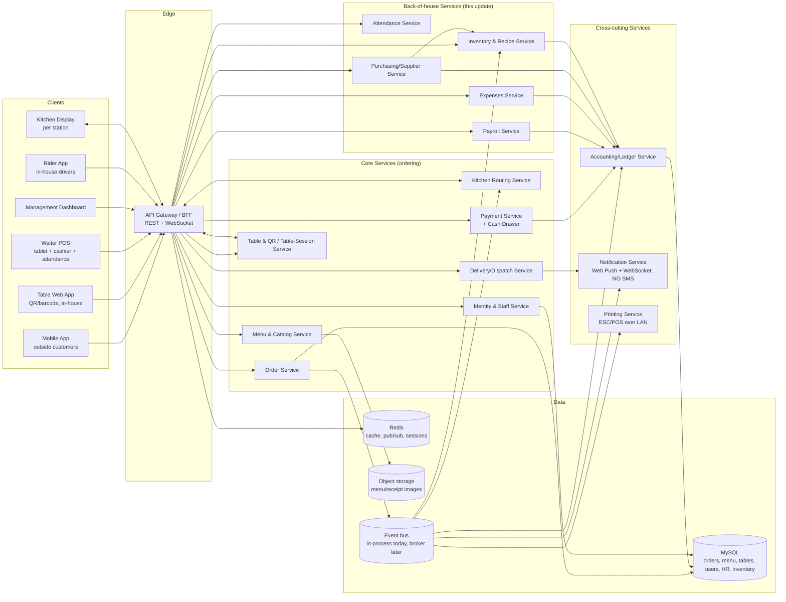
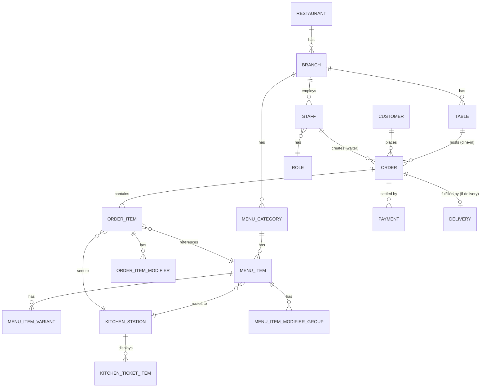
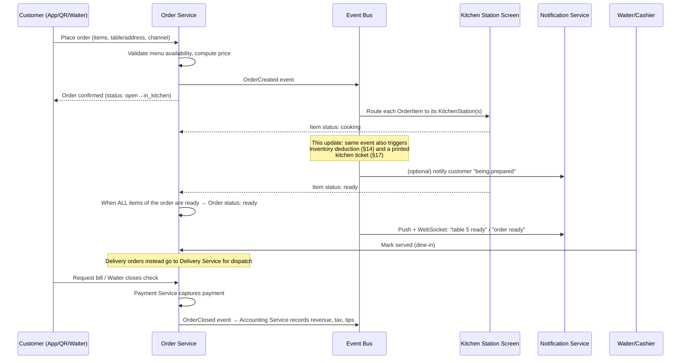
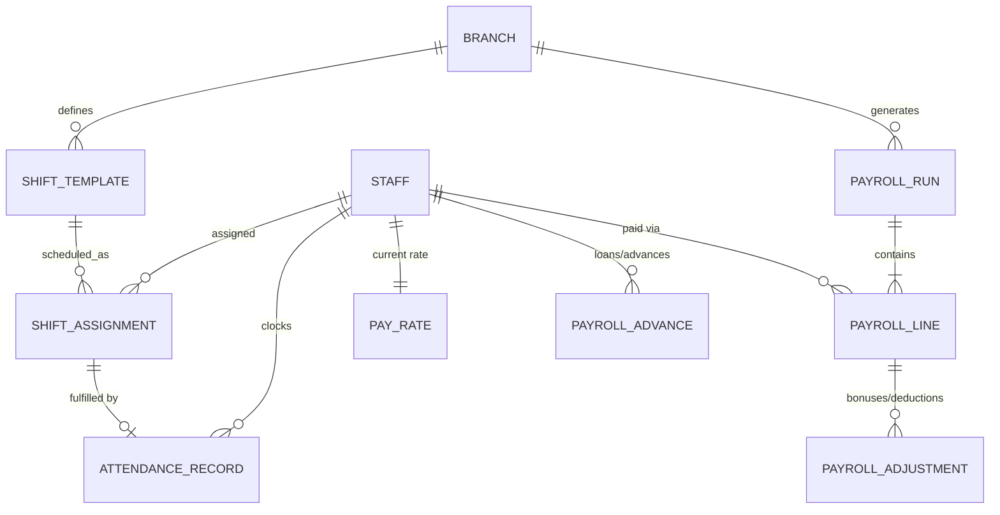
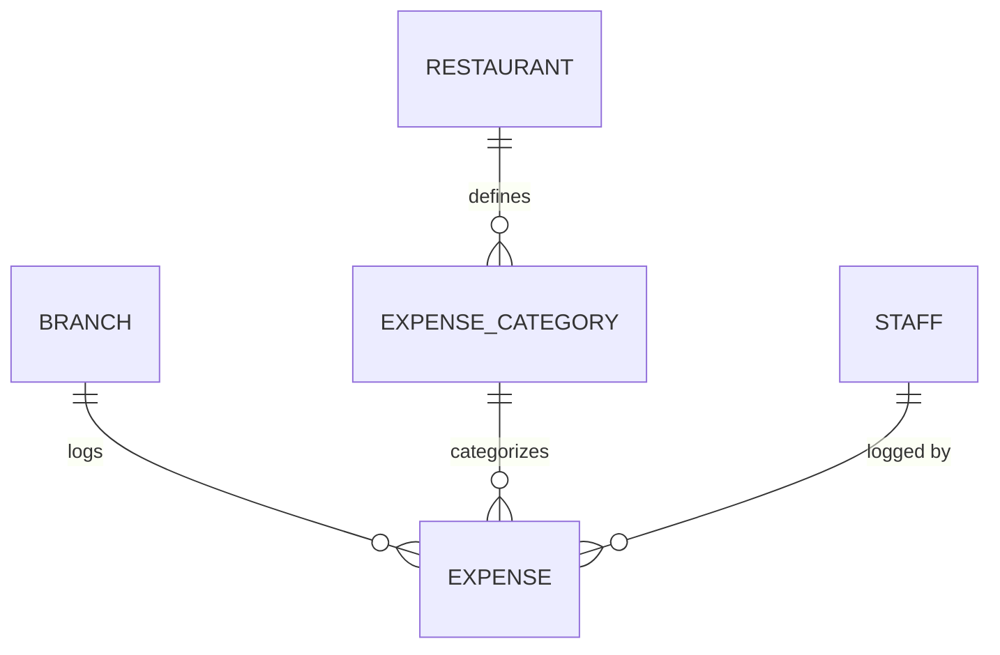
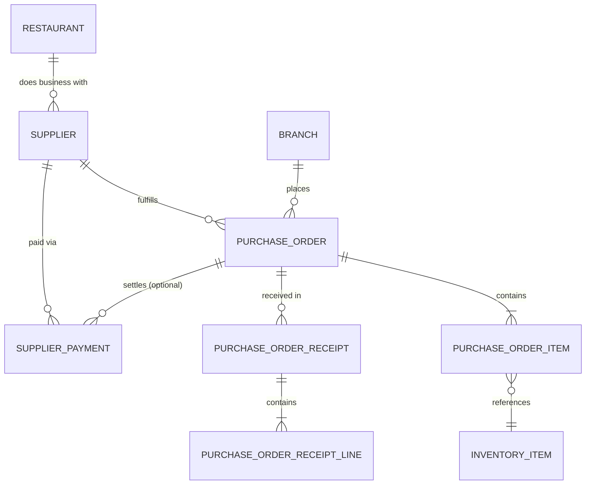
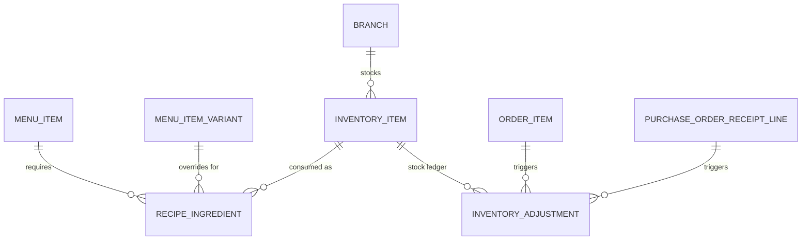
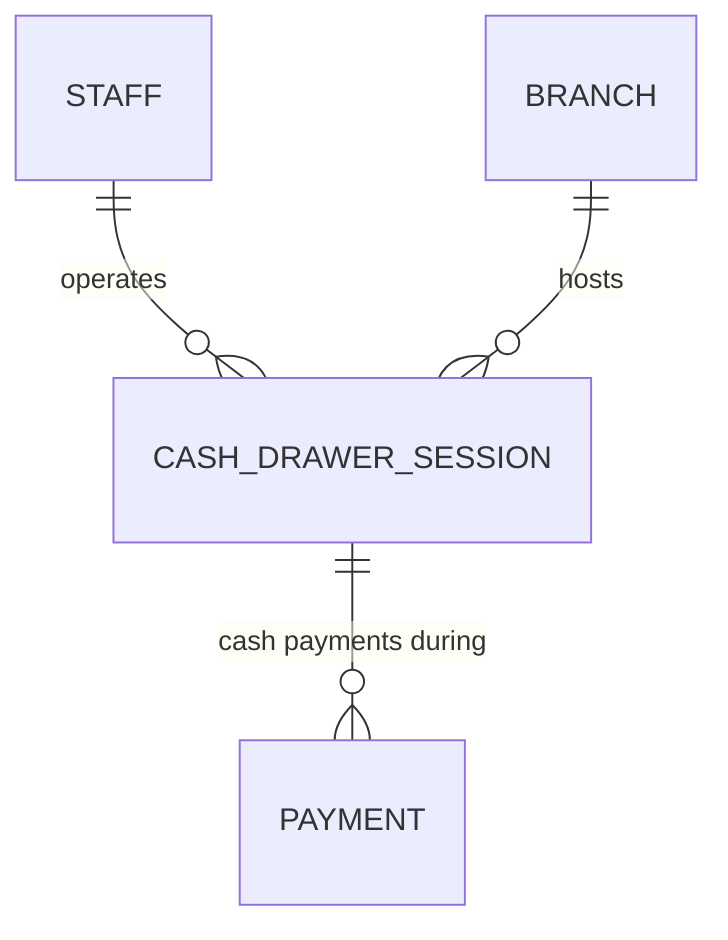
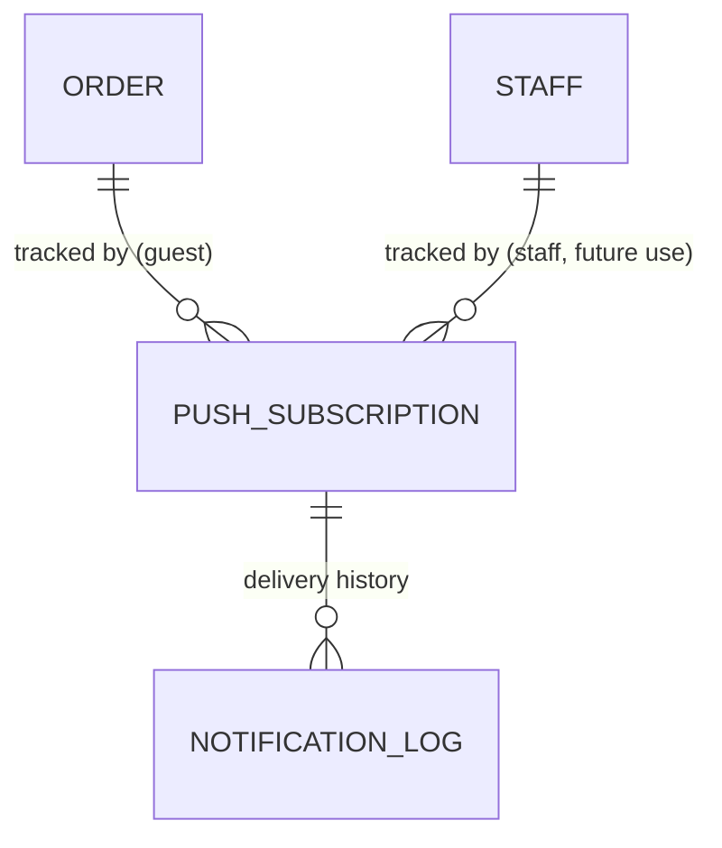
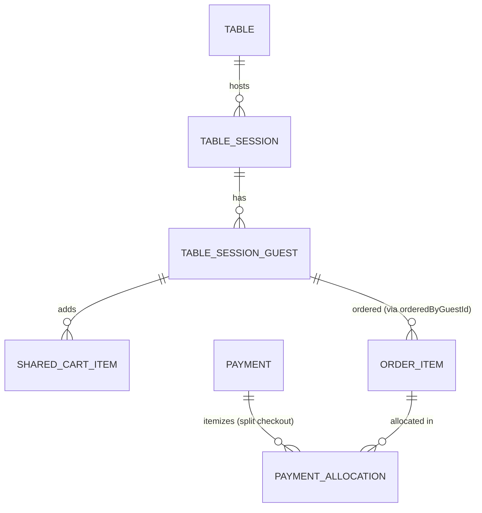

# Restaurant Management System — Implementation Plan

## 1. Vision

A single platform that unifies **three ordering channels** — outside customers on
their phones, in-house customers scanning a table's barcode/QR menu, and
waiters ordering on behalf of guests who don't want to self-serve — into **one
order pipeline** that routes each item to the correct kitchen station in real
time, and feeds a single source of truth for accounting, inventory and
delivery.

Design principle for the whole system: **one Order model, many entry points,
one Kitchen Display System, one ledger.** Every channel (mobile app, table
QR, waiter POS, admin backoffice) is a client of the same core API — nothing
about "how the order was placed" should leak into how it's cooked, billed or
reported.

As the system matures past pure ordering, the same principle extends
backward-of-house: **one Staff model powers login everywhere, one Inventory
ledger powers COGS, one accounting ledger is the single financial source of
truth** — payroll payouts, daily expenses, and supplier debt settlements are
not side-books, they are entries in the same append-only ledger that already
records sales, tax, tips, and refunds.

---

## 2. Actors & Channels

| Actor | Channel | Key need |
|---|---|---|
| Outside customer | Mobile app (iOS/Android) or mobile web | Browse menu, order for delivery/pickup, pay online, track order, get push updates |
| In-restaurant customer | Scans QR/barcode on table → mobile web (PWA, no install) | See table-specific menu, join a shared table cart with other guests, order & pay from their phone, split bill |
| Waiter | Handheld/tablet POS app | Pick a table, build an order for guests who don't self-order, modify/merge orders, take payment, clock in/out |
| Kitchen staff | Kitchen Display System (KDS) — wall-mounted tablets/TVs per station | See only the items relevant to their station (Pizza, Hookah, Grill, Bar, Cold/Salad, Dessert…), mark items in-progress/ready, clock in/out |
| Cashier | POS / floor-view screen | Receives payment for every dine-in check, opens/closes the cash drawer with a counted float, logs daily petty-cash expenses, closes checks, issues receipts, handles refunds |
| Delivery rider (in-house) | Rider app | Receive dispatch, update delivery status, proof of delivery, own fleet — no third-party marketplace |
| Owner / Manager | Management Dashboard (web) | Cross-branch oversight: menu & pricing, sales reports, staff scheduling & payroll, supplier/purchasing, inventory, reconciliation, branch comparison |
| Supplier / Vendor | Not a system user — a record managed by staff | Contact info, payment terms, purchase-order + debt history |

*A dedicated read-only **Accountant** role (financial reports only, no
menu/staff edit rights) is a reasonable separation-of-duties addition once
payroll/expenses/purchasing are live — tracked as an open decision in §22
rather than added unilaterally, so as not to grow the role model further
than the business actually needs.*

---

## 3. High-Level Architecture



**Pattern**: modular monolith (see §21 on phasing) with clear module
boundaries so it can be split into microservices later if scale demands it.
The **event bus** — today `@nestjs/event-emitter` in-process, a drop-in
swap for RabbitMQ/Kafka later without changing payload shapes — is the
backbone that lets Kitchen, Inventory, Accounting, Notifications and
Printing react independently without the Order Service knowing about all of
them. This update adds five new listeners onto **event types that already
exist** (`ORDER_ITEM_CREATED`, `ORDER_ITEM_STATUS_UPDATED`, `ORDER_READY`,
`DELIVERY_STATUS_UPDATED`) rather than inventing a parallel pipeline —
Inventory deducts stock on the same "item started cooking" transition the
Kitchen Display already reacts to; Printing prints a ticket on the same
"item created" transition the KDS already reacts to; Notifications pushes on
the same "order ready"/"delivery status changed" transitions the WebSocket
gateways already broadcast.

---

## 4. Technology Stack

### Backend
- **Language/Framework**: Node.js + TypeScript with **NestJS**, modular
  monolith. Each feature area below (HR, expenses, purchasing, inventory,
  notifications, printing) is its own Nest module — same shape as the
  existing `orders`/`menu`/`deliveries` modules — importable independently
  and, if the system ever splits into microservices, extractable one module
  at a time.
- **API**: REST for CRUD + **WebSocket (Socket.IO)** for real-time
  order/KDS/dispatch/table-session updates — unchanged. New WebSocket
  surface area: a `table-session:{tableId}` room on the existing
  `OrdersGateway` (§18) for shared-cart sync; no new gateways otherwise —
  the new back-of-house modules are REST/reporting-oriented, not real-time.
- **Database**: **MySQL 8**, unchanged — every new table still carries
  `branch_id` (or `restaurant_id` for records like Supplier that are
  intentionally branch-agnostic — see §13). New tables follow the existing
  conventions: UUID primary keys, `@CreateDateColumn`/`@UpdateDateColumn`,
  `type: 'varchar'|'datetime'` explicit on nullable TypeORM columns, soft
  business-state via enums rather than free-text status columns.
- **File/image storage**: unchanged (S3-compatible) — now also used for
  optional expense receipt photos and purchase-order attachments.

### Frontend
No new client apps. The six existing apps absorb this update's UI:

| App | New responsibility added by this update |
|---|---|
| **Waiter POS** | Cashier's cash-drawer open/close flow (§15); staff clock-in/out kiosk reusing the existing PIN picker (§11) |
| **Table PWA** | Shared table-session cart (§18); Web Push subscription (§16) |
| **Mobile Customer** | Web Push subscription (§16) |
| **Kitchen Display** | Printed kitchen tickets are a silent side-effect (§17) — no new screen, an optional "printer offline" banner |
| **Management Dashboard** | New tabs: Shifts & Attendance, Payroll, Expenses, Suppliers & Purchase Orders, Inventory — this is where the bulk of the new UI lives, consistent with it already being the back-office app |
| **Rider App** | No change |

### Infra / Cross-cutting
- **Notifications — Web Push only, no SMS.** This is a scope change from the
  original plan's "SMS (Twilio) as delivery fallback" (§4 previously) —
  explicitly dropped per this update's requirements. Native **Web Push**
  (VAPID keys, the standard Push API + Service Worker mechanism, `web-push`
  npm package server-side) covers both installable PWAs already in this
  project (Table PWA, Mobile Customer). No FCM/APNs dependency is needed
  because neither client is a native app shell — both already register a
  Service Worker via `vite-plugin-pwa`, which this update extends rather
  than replaces. See §16.
- **Printing**: raw **ESC/POS** over a LAN TCP socket (port 9100 convention)
  to network thermal printers — no cloud print service, no driver
  installation. See §17.
- **Payments**: unchanged (cashier-closes-the-check model) — cash-drawer
  reconciliation is now fully specified in §15 rather than left as a §12
  non-functional aspiration.
- Everything else in this section (Redis, S3, Docker, multi-tenancy stance)
  is unchanged from the original plan.

---

## 5. Core Domain Model

The original core ERD (Restaurant → Branch → Table/Menu/Order/Payment/
Delivery/Staff) is unchanged and still accurate — reproduced below. Each new
feature area in §11–§18 has its **own, smaller ERD** in its own section
rather than one unreadable mega-diagram; this section is the index.



### What this update touches on the core model

Two small, additive changes to existing entities (both nullable, both
backward-compatible — no existing row's meaning changes):

- **`OrderItem.status` transition to `cooking`** is now also the trigger for
  Inventory's recipe-based stock deduction (§14) and for Printing's kitchen
  ticket (§17) — no schema change, this reuses the existing
  `ORDER_ITEM_STATUS_UPDATED` event, just adds listeners.
- **`OrderItem.orderedByGuestId`** (new, nullable, FK → `TableSessionGuest`,
  §18) — records which phone at a shared table added that item, for
  per-guest split checkout. Null for every non-QR channel and for QR orders
  placed before this feature existed.

Every other new entity in §11–§18 is additive: new tables, no changes to
`Order`, `Payment`, `MenuItem`, or `Staff` beyond the one column above.

---

## 6. Order Flow (the core state machine)

*(Unchanged from the original plan — reproduced for continuity.)*



### Order statuses
Unchanged: `draft → placed → accepted → in_kitchen (per item: queued →
cooking → ready) → ready_to_serve/ready_for_pickup/out_for_delivery →
completed → paid → closed`, with `cancelled`/`refunded` as terminal/side
states and `needs_attention` for kitchen-flagged issues.

---

## 7. Ordering Channels in Detail

*(Unchanged from the original plan except where §18 now specifies the
shared table-session mechanics that §7.2 always intended but left
underspecified.)*

### 7.1 Mobile app — outside customers
Browse, cart, checkout, order tracking exactly as originally specified.
**This update**: order-tracking push notifications (§16) replace the
originally-planned SMS fallback.

### 7.2 In-restaurant QR/barcode table ordering
Landing page, dine-in menu, live per-item status feedback exactly as
originally specified. **This update**: the "shared table cart" the original
plan described in prose ("the app groups a shared 'table cart' so multiple
phones at one table can add items to a single running order") is now fully
specified as a **pre-order live-synced cart**, not just a post-submission
merge — see §18.

### 7.3 Waiter-assisted ordering
Unchanged, **plus**: the Waiter POS is also where a cashier opens/closes
their cash drawer (§15) and any staff member clocks in/out for their shift
(§11) — both reuse the tablet already at the floor, rather than adding a
seventh app.

---

## 8. Kitchen Display System (KDS) — station routing

Unchanged. **This update**: an optional printed backup of every ticket via
§17, and inventory deduction fires on the same "cooking" bump a KDS
operator already performs — no new action for kitchen staff to take.

---

## 9. Menu Design

Unchanged, **plus**: a `MenuItem`/`MenuItemVariant` can now optionally
declare a **recipe** (§14) — the list of raw ingredients and quantities it
consumes. A menu item with no recipe defined simply never triggers a stock
deduction (opt-in, not required, so v1 adoption can be gradual — a
restaurant can turn on recipes for its top 10 dishes first).

---

## 10. Accounting, Delivery & Reporting

### Accounting — expanded ledger

The append-only `ledger_entries` table (`LedgerEntry`, unchanged shape:
`branchId`, nullable `orderId`, `type`, `amount`, `note`, `createdAt`) gets
new `LedgerEntryType` values so **every** financial flow in the system —
not just sales — lands in the same immutable audit trail:

```
enum LedgerEntryType {
  SALE                // unchanged
  TAX                 // unchanged
  DISCOUNT            // unchanged
  TIP                 // unchanged
  REFUND              // unchanged
  EXPENSE             // NEW — §12, a logged petty-cash/operational expense
  PAYROLL_PAYOUT       // NEW — §11, one entry per staff member per finalized payroll run
  SUPPLIER_PAYMENT     // NEW — §13, a debt settlement/installment paid to a supplier
  CASH_DRAWER_VARIANCE  // NEW — §15, an over/short at drawer close (signed)
}
```

`orderId` stays nullable and is simply `null` for the four new types — they
aren't tied to a specific customer order, but every one of them still
carries `branchId`, an `amount`, and enough context in `note` (or a foreign
key on the *source* record — `PayrollLine`, `Expense`, `SupplierPayment`,
`CashDrawerSession` each already point back to the ledger implicitly via
being the thing that triggered the entry) to answer "why does this ledger
line exist" without ambiguity.

**Cash-basis ledger, accrual-basis subledgers.** A deliberate design
decision worth stating explicitly: the ledger only ever records **actual
cash movements** (a sale captured, a refund issued, an expense paid, a
payroll run paid out, a supplier payment made). A purchase order's
outstanding balance and a payroll run's *unpaid* draft are **not** ledger
entries — they live as balances on `Supplier`/`PurchaseOrder`/`PayrollRun`
themselves (§11, §13) until the moment they're actually settled, at which
point a ledger entry is created. This mirrors how the existing `Payment`
entity already works (a `Payment` row is the source of truth for *what was
charged*; the `LedgerEntry` row is the source of truth for *what hit the
books*) and avoids double-counting a liability as if it were a paid expense.

**Net profit formula**, now computable directly from the ledger for any
date range and branch:

```
Gross Revenue        = SUM(SALE) + SUM(TIP)          [TIP often reported separately from restaurant P&L]
  − Discounts         = SUM(DISCOUNT)
  − Refunds           = SUM(REFUND)
= Net Sales

Net Sales
  − COGS              = SUM(InventoryAdjustment.totalCostSnapshot WHERE reason = order_deduction)  [§14]
= Gross Profit

Gross Profit
  − Daily Expenses    = SUM(EXPENSE)                  [§12]
  − Payroll           = SUM(PAYROLL_PAYOUT)            [§11]
  − Supplier Payments = SUM(SUPPLIER_PAYMENT)           [§13, cash-basis — see note above]
  +/− Cash Variance   = SUM(CASH_DRAWER_VARIANCE)        [§15]
= Net Profit
```

This is exactly the "Gross Revenue minus (COGS + Daily Expenses + Payroll)"
formula requested, extended to also net out supplier cash payments and
drawer variances since both are real cash movements a true net-profit
figure has to include. The Management Dashboard's Reports tab (already
built, currently summing `SALE`/`TIP`/`TAX`/`DISCOUNT`/`REFUND` per §Reports
in the dashboard's own README) gets new stat tiles for each new line and a
Net Profit headline figure, following the same per-branch / summed-across-
branches pattern already used for the existing report.

### Delivery — own fleet, no marketplace

Unchanged from the original plan and from the now-shipped Rider App —
reproduced for continuity: in-house drivers only, `Delivery` record per
order with a status timeline, manual v1 dispatch from the Management
Dashboard, per-branch driver rosters. Delivery status-change events now
also feed the Notification Service (§16) for customer-facing push.

---

## 11. HR: Shifts, Attendance & Payroll

Two new Nest modules, `attendance` and `payroll`, as requested — split
because they have different write cadences (attendance is written
continuously through a shift; payroll is computed periodically from a
finalized window of attendance data) even though they're presented together
in the Management Dashboard under one "Staff & Payroll" area.

### Data model



- **`ShiftTemplate`** — `branchId`, `name` (e.g. "Morning", "Afternoon",
  "Night"), `startTime`/`endTime` (time-of-day), `daysOfWeek` (JSON array of
  0–6), `active`. Supports "3 daily shifts/rotations per branch" directly —
  a branch just defines three templates.
- **`ShiftAssignment`** — the roster: `branchId`, `staffId`,
  `shiftTemplateId`, `date`, `status` (scheduled/swapped/cancelled). A
  manager builds the week's roster by assigning staff to dated instances of
  a template.
- **`AttendanceRecord`** — `branchId`, `staffId`, nullable
  `shiftAssignmentId` (links back to what was scheduled, if anything — a
  clock-in with no matching assignment is still recorded, just flagged
  `unscheduled`), `clockInAt`, `clockOutAt` (nullable until clock-out),
  `clockInMethod`/`clockOutMethod` (enum: `pin`), `totalMinutesWorked`
  (computed on clock-out), `status` (`present`/`absent`/`late`/
  `early_leave`/`unscheduled`), `note`.
  - **Clock-in/out UX reuses the PIN login component that already exists**
    (built for Waiter POS, Kitchen Display, and the Rider App's staff
    picker) — no new auth mechanism. A new "Attendance" tab is added to the
    Waiter POS (the tablet already at the front of house) where any staff
    member taps their name, enters their PIN, and the system toggles
    clock-in/clock-out based on whether they already have an open
    `AttendanceRecord` today. This is a UI addition to an existing app, not
    a new client.
  - Absences are derived, not manually logged: a nightly (or on-demand,
    computed at report time) job compares `ShiftAssignment` rows for a date
    against matching `AttendanceRecord` rows — a scheduled shift with no
    attendance record by end of day is an absence.
- **`PayRate`** — `staffId`, `payType` (`hourly`/`monthly`), `baseRate`,
  `overtimeMultiplier` (e.g. `1.5`), `effectiveFrom`. Kept as its own
  small table (not a column on `Staff`) so a rate change is a new row, and
  historical payroll runs always compute against the rate that was actually
  in effect at the time — never retroactively recomputed.
- **`PayrollAdvance`** — `staffId`, `branchId`, `amount`, `reason`,
  `issuedAt`, `issuedByStaffId`, `remainingBalance`, `status`
  (`active`/`settled`). An advance/loan is issued outside payroll (a
  manager action, itself worth its own ledger visibility — see open
  question in §22) and then deducted from future `PayrollLine`s until
  `remainingBalance` reaches zero.
- **`PayrollRun`** — `branchId`, `periodStart`, `periodEnd`, `status`
  (`draft`/`finalized`/`paid`), `generatedAt`, `generatedByStaffId`. A
  manager generates a draft (computed from attendance + pay rates for the
  window), reviews it, finalizes it, then marks it paid — only the `paid`
  transition writes `PAYROLL_PAYOUT` ledger entries, consistent with the
  cash-basis rule in §10.
- **`PayrollLine`** — one row per staff member per run: `payrollRunId`,
  `staffId`, `hoursWorked`, `overtimeHours` (both summed from
  `AttendanceRecord.totalMinutesWorked` in the period, computed against the
  branch's standard shift length), `basePayAmount`, `overtimeAmount`,
  `bonusAmount`, `deductionAmount`, `advanceDeductionAmount`, `netPay`
  (computed: base + overtime + bonus − deduction − advance deduction).
- **`PayrollAdjustment`** — itemized, auditable bonuses/deductions on a
  line: `payrollLineId`, `type` (`bonus`/`deduction`), `amount`, `note`,
  `addedByStaffId`. Keeps "why is this person's pay different from the
  formula" answerable per-line rather than as an opaque override.

### Reporting
Management Dashboard gets: a weekly roster/calendar view (build off
`ShiftTemplate` + `ShiftAssignment`), a daily attendance board (present/
late/absent per branch, today), hours-worked summaries (day/week/month —
directly from `AttendanceRecord`), and a payroll-run screen (generate
draft → review/adjust → finalize → mark paid, at which point it posts to
the ledger and becomes immutable like every other financial record).

---

## 12. Daily Expenses (Petty Cash & Operational Expenses)

New `expenses` module.



- **`ExpenseCategory`** — `restaurantId` (shared across branches — "gas",
  "electricity", "cleaning supplies", "repairs", "market buys" are the same
  taxonomy everywhere), `name`, `isDefault` (seeded categories vs.
  restaurant-added ones).
- **`Expense`** — `branchId`, `categoryId`, `amount`, `description`,
  `receiptNote` (free text — "paper receipt #4821 in the drawer") and/or
  `receiptImageUrl` (optional photo upload to object storage — either or
  both, never required, since a real petty-cash drawer often just has a
  handwritten note), `loggedByStaffId` (cashier or manager — matches the
  requirement that both roles can log), `spentAt` (the actual date of
  spend, which may be backdated slightly, distinct from `createdAt`).

**No approval gate in v1** — any cashier/manager logging an expense posts
an `EXPENSE` ledger entry immediately, with `loggedByStaffId` as the audit
trail (exactly how `Payment.cashierStaffId` already works). A manager-
approval-above-threshold workflow is a reasonable v2 addition once there's
real usage data on what expense sizes actually warrant a second sign-off —
flagged in §22 rather than built speculatively.

### Reporting
Management Dashboard gets an Expenses tab (log/list/filter by category and
date range) and the category breakdown feeds directly into the net-profit
formula in §10.

---

## 13. Procurement, Supplier Management & Accounts Payable

New `purchasing` module. Integrates with `inventory` (§14) for stock
updates on receipt and with `accounting` (§10) for debt settlements.



- **`Supplier`** — scoped to `restaurantId`, **not** `branchId` (a produce
  vendor typically serves every branch of a chain under one account/terms —
  see §22 for the case where a restaurant wants branch-specific suppliers
  instead). `name`, `contactName`, `phone`, `email`, `address`,
  `paymentTermsDays` (e.g. net-30), `active`. `currentBalance` is exposed as
  a **computed** value (unpaid `PurchaseOrder` totals minus
  `SupplierPayment` totals) rather than a stored column, so it can never
  drift from the underlying records — the same "derive, don't duplicate"
  principle the existing accounting summary already follows.
- **`PurchaseOrder`** — `branchId` (a specific branch places the order even
  though the supplier is restaurant-wide), `supplierId`, `status`
  (`draft`/`ordered`/`partially_received`/`received`/`cancelled`),
  `orderedAt`, `expectedAt`, `createdByStaffId`, `notes`.
- **`PurchaseOrderItem`** — `purchaseOrderId`, `inventoryItemId` (§14),
  `description` (name snapshot, same "never recompute history" principle as
  `OrderItem.nameSnapshot`), `quantityOrdered`, `quantityReceived` (running
  total), `unitCost`, `lineTotal`.
- **`PurchaseOrderReceipt`** / **`PurchaseOrderReceiptLine`** — receiving
  can happen in multiple partial deliveries against one PO, so each
  delivery is its own append-only receipt event (`receivedAt`,
  `receivedByStaffId`) with line items (`purchaseOrderItemId`,
  `quantityReceived`). Each receipt line **atomically**: increments
  `PurchaseOrderItem.quantityReceived`, increments the linked
  `InventoryItem.currentStock` (§14), and updates
  `InventoryItem.averageUnitCost` via a weighted-average recompute — this
  is the automatic "update stock levels upon receipt" the requirement asks
  for, and it's also where a real ingredient cost for COGS comes from.
- **`SupplierPayment`** — `branchId`, `supplierId`, nullable
  `purchaseOrderId` (a payment can settle one specific PO or be a general
  account payment against the running balance — net-30 vendors are
  typically billed/paid in aggregate, not PO-by-PO), `amount`, `method`,
  `paidAt`, `paidByStaffId`, `note`. Writing a `SupplierPayment` row is
  exactly what posts the `SUPPLIER_PAYMENT` ledger entry from §10.

### Reporting
Management Dashboard gets a Suppliers tab (profile, balance, payment
history), a Purchase Orders tab (create → mark ordered → receive, partial
receipts supported), and an Accounts Payable view (outstanding balance per
supplier, aging by `paymentTermsDays`).

---

## 14. Inventory & Recipe Management (COGS & Stock Tracking)

New `inventory` module. This is the module that makes "food cost" a real,
computed number instead of a spreadsheet guess.



- **`InventoryItem`** (a raw ingredient) — `branchId`, `name`, `unit`
  (enum: `kg`/`g`/`l`/`ml`/`each` — an enum, not a lookup table, matching
  this codebase's existing preference for enums over reference tables where
  the set is small and stable; a conversion-factor table can be added later
  if unit conversion becomes necessary), `currentStock`, `reorderThreshold`,
  `reorderQuantity` (suggested reorder amount, informational), `active`.
  `averageUnitCost` is maintained by the purchasing module's receiving flow
  (§13) via a weighted-average recompute on every receipt — this is the
  cost figure recipes are costed against.
- **`RecipeIngredient`** — the requested "link menu items/variants to raw
  ingredients" mapping: `menuItemId`, nullable `menuItemVariantId` (a
  recipe can be defined at the base item level, or overridden per variant —
  e.g. a "Large" pizza's recipe uses more cheese than the base item's
  recipe), `inventoryItemId`, `quantityRequired` (in the ingredient's
  unit). **Opt-in**: a menu item with no `RecipeIngredient` rows simply
  never deducts stock — a restaurant can wire up recipes for its highest-
  volume dishes first rather than needing full catalog coverage on day one.
- **`InventoryAdjustment`** — an **append-only stock ledger**, mirroring
  the accounting ledger's own philosophy (never mutate `currentStock`
  directly — always through a logged, attributable adjustment):
  `branchId`, `inventoryItemId`, `quantityDelta` (signed), `reason` (enum:
  `purchase_receipt`/`order_deduction`/`waste`/`manual_correction`/
  `stocktake`), `referenceType`/`referenceId` (points back to the
  `PurchaseOrderReceiptLine` or `OrderItem` that caused it, where
  applicable), `staffId` (who triggered a manual one), `unitCostSnapshot`
  and `totalCostSnapshot` (captured at deduction time, so COGS reporting
  stays accurate even if `averageUnitCost` changes later — the same
  snapshot-pricing principle `OrderItem.priceSnapshot` already uses).

### Auto-deduction flow
Reuses the exact hook point that already exists rather than adding new
plumbing: `OrdersService.updateItemStatus` already fires
`ORDER_ITEM_STATUS_UPDATED` on every status change, and the `cooking`
transition is the moment ingredients are actually consumed (not order
placement, and not "ready", both of which are too early/late relative to
when a cook actually pulls stock). A new `InventoryService` listener on
that event, filtered to `status === cooking`, looks up `RecipeIngredient`
rows for the item's `menuItemId`(+`menuItemVariantId`), and writes one
`InventoryAdjustment` per ingredient (`reason: order_deduction`,
`quantityDelta: -(recipeQty × orderItem.quantity)`).

### Reorder alerts
When a deduction leaves `InventoryItem.currentStock` at or below
`reorderThreshold`, an internal `INVENTORY_LOW_STOCK` event fires; the
Management Dashboard's new Inventory tab surfaces it as a banner/list. No
push/SMS for this in v1 — an in-dashboard alert is sufficient since it's a
management-facing signal, not a customer- or floor-staff-facing one.

### COGS integration
Feeds §10's net-profit formula directly:
`COGS = SUM(InventoryAdjustment.totalCostSnapshot WHERE reason = order_deduction)`
for the reporting period — a real, ingredient-level food cost rather than
an estimate.

---

## 15. Cash Drawer Reconciliation

Lives in the existing `payments` module (tightly coupled to the cashier
role that already operates there) rather than a new module.



- **`CashDrawerSession`** — `branchId`, `cashierStaffId`, `openedAt`,
  `openingFloat` (counted cash at shift start, entered by the cashier),
  nullable `closedAt`, `expectedClosingCash` (computed at close time:
  `openingFloat + SUM(cash Payment.amount during session) − SUM(cash
  REFUND during session)`), `countedClosingCash` (entered by the cashier),
  `variance` (`countedClosingCash − expectedClosingCash`, signed —
  positive is an overage, negative a shortage), `varianceNote` (required
  whenever `variance != 0`), `status` (`open`/`closed`).

**"Open Shift"/"Close Shift" flow**: a cashier opens a session from the
Waiter POS at the start of their shift by counting and entering the
starting float; every cash `Payment` they take is (already, via
`Payment.cashierStaffId`) attributable to them and, by time range, to their
open session; at shift end they count the drawer, enter
`countedClosingCash`, and the system computes and displays the variance
before closing. Closing writes a `CASH_DRAWER_VARIANCE` ledger entry
(§10) — even a `0` variance is worth a zero-amount entry for a complete
audit trail of every session that ever ran, though the reporting UI would
only visually flag non-zero ones.

### Reporting
Management Dashboard gets a Cash Sessions view (history of opens/closes per
cashier, flagged variances) alongside the existing Reports tab.

---

## 16. In-App & Mobile Push Notifications (replacing SMS)

New `notifications` module. **No SMS integration anywhere in this system —
explicitly dropped from the original plan's Twilio-fallback mention.**



- **`PushSubscription`** — the client's Web Push endpoint (Push API
  standard): `subjectType` (`order`/`staff` — polymorphic, since a guest
  has no account to hang a subscription off, so it's anchored to the order
  they're tracking; a staff-scoped variant is modeled now for a v2 need
  like "notify the manager on a large refund" but is not wired to any
  sender in this v1 scope), `subjectId`, `endpoint`, `p256dh`/`auth` keys
  (per the Push API spec), `createdAt`, nullable `expiresAt`.
- **`NotificationLog`** — append-only send record: `subscriptionId`,
  `orderId`, `event` (`order_ready`/`order_out_for_delivery`/
  `delivery_status_changed`/etc.), `payload`, `sentAt`, `status`
  (`sent`/`failed`). Exists for debugging/audit, not for retry logic — a
  failed push is not retried (the client's own WebSocket connection, when
  open, already carries the same status update live; push only covers the
  screen-off/app-backgrounded gap, so a missed push is not silently losing
  information the customer needed).

### How it plugs into what already exists
`NotificationsService` adds itself as another `@OnEvent` listener on the
**same events the existing gateways already consume** —
`ORDER_ITEM_STATUS_UPDATED`, `ORDER_READY` (from `orders`/`kitchen`), and
`DELIVERY_STATUS_UPDATED` (from `deliveries`, added when the Rider App
shipped). For each event, it looks up any `PushSubscription` rows for that
`orderId` and sends a Web Push payload via the `web-push` npm package
(VAPID auth, no third-party push gateway beyond the browser vendors'
own push services — Chrome/Firefox/etc. — which is how the standard works).
This is **additive** to the existing WebSocket broadcast, not a
replacement: while the Table PWA/Mobile Customer tab is open, the existing
`useOrderSocket`/tracking hooks keep working exactly as they do today; push
is what reaches the customer when they've locked their phone or switched
apps.

### Frontend
Table PWA and Mobile Customer are **already** installable PWAs with a
Service Worker (`vite-plugin-pwa`) — this update extends that existing
Service Worker with a push event handler rather than standing up new build
tooling. Both apps request `Notification` permission **after an order is
placed** (not on page load, respecting "ask at the point of value"), then
call the browser's Push API to subscribe and `POST` the subscription to
`/notifications/subscribe` with the current `orderId`.

---

## 17. Network Thermal Printing (ESC/POS)

New, small `printing` module — a service-style module, not an
entity-heavy one, since a print job is a fire-and-forget side effect, not
durable state that needs a queue/worker.

- **`PrinterConfig`** — `branchId`, nullable `kitchenStationId` (a kitchen
  ticket printer is tied to one station; a receipt/pre-bill printer is
  tied to the branch generally), `name`, `connectionType` (enum:
  `network_tcp` in v1 — `usb` reserved as a future value, out of scope
  since the requirement is explicitly LAN printing), `ipAddress`, `port`
  (default `9100`, the standard raw ESC/POS listener port most thermal
  printers expose), `paperWidthMm` (`58`/`80`), `active`.
- **`PrintJobLog`** — append-only, for failure visibility only:
  `printerConfigId`, `jobType` (`kitchen_ticket`/`pre_bill`/`receipt`),
  `referenceId` (the `OrderItem` or `Order` id), `status`
  (`sent`/`failed`), `errorMessage`, `createdAt`.

### Design decision: printing never blocks the order flow
`PrintingService` opens a raw TCP socket directly to `PrinterConfig.
ipAddress:port` and streams ESC/POS byte sequences (via the
`node-thermal-printer` package's network transport, or hand-built ESC/POS
commands for full control over ticket layout) **synchronously but
fire-and-forget relative to the request that triggered it** — if a printer
is offline, the print attempt fails, a `PrintJobLog` row records it, and an
"printer offline" banner surfaces on the relevant Kitchen Display station
or the Waiter POS, but the order/payment/kitchen-routing flow that
triggered the print is never blocked or rolled back on a print failure. A
paper ticket is a convenience/backup, not a step in the state machine —
the on-screen KDS ticket (already real-time and reliable) remains the
authoritative signal.

### Trigger points
Both reuse events that already exist, keyed by `kitchenStationId` →
`PrinterConfig` lookup — no new event types:
- **Kitchen tickets**: `@OnEvent(ORDER_ITEM_CREATED)` — the exact event the
  Kitchen Display's own gateway already listens to, so printed tickets stay
  in lockstep with on-screen ones.
- **Guest pre-bills/receipts**: on a bill request (table PWA "request the
  bill" action) or `OrderClosed`/`Payment` capture — prints an itemized
  receipt to the branch's configured receipt printer.

---

## 18. Shared Table Order Session (Multi-Guest QR Ordering)

Extends the existing `tables` module rather than becoming a new one — this
formalizes a mechanic the original plan already described in prose (§7.2)
but never gave its own entities, since until now every phone's cart was
purely local (`CartContext`) and only merged with other guests' orders
*after* submission via `findActiveForTable`. This update makes the cart
itself live-shared, pre-submission.



- **`TableSession`** — `branchId`, `tableId`, `status`
  (`active`/`closed`), `startedAt`, `closedAt`. Represents one continuous
  dining occupancy, existing from the *first* QR scan (before any item is
  even added) through to the table being cleared — a slightly earlier
  starting point than `Order` (which today only exists once the first item
  is submitted), which is what makes a genuinely pre-order live cart
  possible.
- **`TableSessionGuest`** — `tableSessionId`, `guestLabel` (default "Guest
  N", editable), `deviceToken` (an anonymous identifier generated
  client-side and stored in that phone's `localStorage` — re-opening the
  same table's QR link on the same phone rejoins as the same guest rather
  than creating a duplicate), `joinedAt`.
- **`SharedCartItem`** — the **pre-order** cart, distinct from `OrderItem`:
  `tableSessionId`, `guestId` (which phone added it), `menuItemId`,
  `menuItemVariantId`, `modifierOptionIds` (JSON array), `quantity`,
  `notes`, `addedAt`. Every phone at the table subscribes to a new
  `table-session:{tableId}` WebSocket room (added to the **existing**
  `OrdersGateway` — not a new gateway, since it's conceptually adjacent to
  the `order:{id}`/`branch:{id}:floor` rooms already there) and sees
  `cart-item-added`/`cart-item-removed`/`guest-joined` events live. A guest
  can remove their own items by default (a sane social-norm default,
  revisitable — see §22).
- **Submission**: when any guest (or the table collectively) submits,
  every `SharedCartItem` for the session converts 1:1 into an `OrderItem`
  via the existing `appendItems` flow, carrying `guestId` forward into the
  new `OrderItem.orderedByGuestId` column from §5 — this is the one live
  schema touch on the core model, and it's what makes split checkout
  possible afterward.
- **Split checkout, two modes**:
  - **Split evenly** needs no new schema — the client simply divides the
    order total by guest count and creates that many `Payment` rows
    (already supported: `Payment` has no "must cover the whole order"
    constraint).
  - **Pay for your own items** needs to know *which* payment covered
    *which* items: a new **`PaymentAllocation`** join table
    (`paymentId`, `orderItemId`, `allocatedAmount`) records that, built the
    same way a real split-item receipt works — one `Payment` per guest,
    each with `PaymentAllocation` rows for the `OrderItem`s (grouped by
    `orderedByGuestId`) it's covering.

### Frontend (Table PWA)
The existing `CartContext` becomes session-aware: on load it joins
`table-session:{tableId}`, renders every guest's live additions (not just
the local phone's), and "Checkout" gains the two split modes above
alongside the existing single-payer flow.

---

## 19. Suggested Repository Structure (monorepo)

```
restaurant-platform/
├── apps/
│   ├── mobile-customer/        # PWA - outside ordering (+ Web Push, §16)
│   ├── table-pwa/              # PWA - QR/barcode dine-in (+ shared cart §18, Web Push §16)
│   ├── waiter-pos/             # tablet - orders (+ Attendance kiosk §11, Cash Drawer §15)
│   ├── kitchen-display/        # KDS, kiosk mode
│   ├── management-dashboard/   # menu, staff, reports (+ Shifts/Payroll/Expenses/Suppliers/Inventory tabs)
│   └── rider-app/              # delivery riders
├── services/
│   └── api/                    # NestJS modular monolith
│       └── src/modules/
│           ├── restaurants/  branches/  staff/  auth/  tables/   # existing
│           ├── menu/  kitchen/  orders/  payments/  deliveries/  # existing
│           ├── accounting/                                       # existing, expanded ledger types (§10)
│           ├── attendance/     # NEW §11
│           ├── payroll/        # NEW §11
│           ├── expenses/       # NEW §12
│           ├── purchasing/     # NEW §13
│           ├── inventory/      # NEW §14
│           ├── notifications/  # NEW §16
│           └── printing/       # NEW §17
│                                # cash-drawer entities live in payments/ (§15)
│                                # table-session entities live in tables/ (§18)
└── docs/
    └── IMPLEMENTATION_PLAN.md  # this file
```

Same monorepo, same modular-monolith backend — this update adds seven new
Nest modules and extends three existing ones (`accounting`, `payments`,
`tables`); it does not change the overall repo shape or introduce a build
tool/package-manager change.

---

## 20. Non-Functional Requirements

*(Original NFRs unchanged — additions below.)*

- **Printing degrades gracefully**: a printer being offline never blocks
  order placement, kitchen routing, or payment capture (§17) — it's a
  side-effect, not a step in the state machine.
- **Push delivery is best-effort, not guaranteed**: a missed push is
  acceptable because the same status is always also available live over
  the existing WebSocket connection when the app is open, and persisted in
  order history either way — push is a convenience channel, not the
  system of record (§16).
- **Financial auditability now covers back-of-house flows too**: payroll,
  expenses, and supplier payments are appended to the same immutable
  ledger as sales — no financial flow in the system is a mutable row
  anywhere (§10).
- **Inventory deduction is attributable and reversible-by-correction**:
  every stock change is a logged `InventoryAdjustment`, never a direct
  mutation of `currentStock` — a mis-deduction is fixed with an offsetting
  `manual_correction` adjustment, never an edit to history (§14).

---

## 21. Phased Roadmap

**Build status of the original plan** (for continuity — these phases are
implemented and shipped, not just planned):
- ✅ **Phase 0 — Foundations**: done (auth/RBAC, MySQL schema, multi-branch).
- ✅ **Phase 1 — Core ordering + KDS**: done (Table PWA, Order service,
  item-level status, Kitchen Display, station routing).
- ✅ **Phase 2 — Waiter POS + payments**: done (floor view, order-on-behalf,
  cashier-closes-the-check model).
- ✅ **Phase 3 — Outside ordering + delivery**: done (Mobile Customer app,
  Rider App, in-house dispatch).
- 🟡 **Phase 4 — Accounting & reporting**: **partially** done — the
  immutable ledger, sales/tax/tip/discount/refund tracking, and the
  Management Dashboard's Reports tab exist today. COGS, inventory,
  cash-drawer reconciliation, payroll and expense ledger lines did **not**
  exist before this update — that gap is exactly what §11–§15 close.

**This update's new phases:**

**Phase 5 — HR foundation (attendance + payroll)**
`attendance` and `payroll` modules, `ShiftTemplate`/`ShiftAssignment`
roster, PIN clock-in/out kiosk on Waiter POS, `PayRate`/`PayrollAdvance`,
draft→finalize→paid `PayrollRun` flow, `PAYROLL_PAYOUT` ledger entries.
→ *Milestone: a manager builds next week's 3-shift roster, staff clock in
via PIN, and a payroll run at month-end correctly nets out an advance and
pays out via the ledger.*

**Phase 6 — Money in/out (expenses + purchasing + cash drawer)**
`expenses` module with categorized petty-cash logging; `purchasing` module
with `Supplier`/`PurchaseOrder`/receiving/`SupplierPayment`; cash-drawer
open/close on the Waiter POS with variance logging.
→ *Milestone: a cashier opens their drawer with a counted float, logs a
gas-bill expense mid-shift, closes the drawer with a variance correctly
computed and logged, and a manager records a partial payment against an
open supplier balance — all three post to the same ledger.*

**Phase 7 — Inventory, COGS & notifications**
`inventory` module, `RecipeIngredient` mapping for top menu items,
auto-deduction on the `cooking` transition, reorder alerts;
`notifications` module with Web Push wired into Table PWA + Mobile
Customer (replacing the plan's old SMS-fallback line entirely).
→ *Milestone: cooking a mapped dish visibly decrements ingredient stock
with a correct cost snapshot, a real COGS figure appears in Reports, and a
customer who backgrounds the Mobile Customer app still gets a push the
moment their order is ready.*

**Phase 8 — Printing & shared table sessions**
`printing` module with network ESC/POS for kitchen tickets and pre-bills;
`TableSession`/`SharedCartItem` live cart sync on the Table PWA, split
checkout (even split + `PaymentAllocation` itemized split).
→ *Milestone: an item created on the KDS also prints a physical kitchen
ticket within the same second; four guests at one table each add items
from their own phones and see everyone else's live, then two of them pay
for just their own items.*

**Phase 9 — Hardening & scale** *(unchanged from original plan)*
Load testing the real-time path, loyalty/promotions, analytics, third-party
delivery marketplace integrations if desired.

---

## 22. Decisions

Confirmed (original, unchanged):
- **Database**: MySQL.
- **Delivery**: in-house drivers only, own rider app — no third-party
  marketplace.
- **Branches**: multi-branch-native from Phase 0.
- **Dine-in payment**: cashier role always receives the money and closes
  the check.
- **Management Dashboard**: required, with per-branch and cross-branch
  views.

Confirmed (this update):
- **No SMS anywhere in the system** — Web Push (+ existing WebSocket) is
  the only order-status notification channel. Twilio/SMS is fully removed
  from the plan, not just deprioritized.
- **Ledger stays cash-basis**: purchase-order debt and unpaid payroll are
  balances on their own records, not ledger entries, until actually paid
  (§10) — avoids double-counting a liability as a paid expense.
- **Suppliers are restaurant-wide, not branch-scoped**; `PurchaseOrder`s
  are branch-scoped against a shared supplier roster.
- **Recipe mapping is opt-in per menu item** — no requirement to cost out
  the entire catalog before COGS reporting has any value.
- **Printing is LAN-only (ESC/POS over TCP)** — no cloud print service, no
  USB support in v1, printing never blocks the order/payment flow on
  failure.
- **HR/purchasing/inventory administration reuses existing roles**
  (owner/admin/manager) — no new `Role` enum values added by this update.

Still open — confirm when convenient, doesn't block starting the build:
1. *(carried over)* Which payment processor for the mobile app's online
   payments?
2. *(carried over)* Do dine-in QR-ordering guests pay directly from their
   phone, or does every dine-in check go through the cashier? (Directly
   relevant now to §18's split-checkout design — the `PaymentAllocation`
   model assumes guests *can* pay individually from their phones.)
3. *(carried over)* Is a local-network offline order-taking fallback needed
   restaurant-wide, not just the waiter app?
4. Should a dedicated **Accountant** role (read-only financial reports, no
   menu/staff/order edit rights) be added now that payroll/expenses/
   purchasing significantly widen what "financial data" means in this
   system, or is reusing manager/owner sufficient for the near term?
5. Should `PayrollAdvance` issuance itself post an immediate ledger entry
   (money leaving the business the moment a loan is handed out) in addition
   to the `PAYROLL_PAYOUT` entries that later net it out — i.e. should an
   advance be cash-basis-visible at issuance, not just at repayment?
6. Are suppliers ever genuinely branch-specific in practice (a branch in a
   different city using a different local vendor for the same goods)? If
   so, `Supplier` may need an optional `branchId` override rather than
   being strictly restaurant-wide.
7. Should `TableSessionGuest` removal rights extend beyond "your own
   items" — e.g. should a designated "host" guest (the first to join) be
   able to remove anyone's item, for the common case of one person
   organizing the table?

---

*This document is the living specification for the build. Update it as
decisions in §22 are made and as each phase is delivered.*
