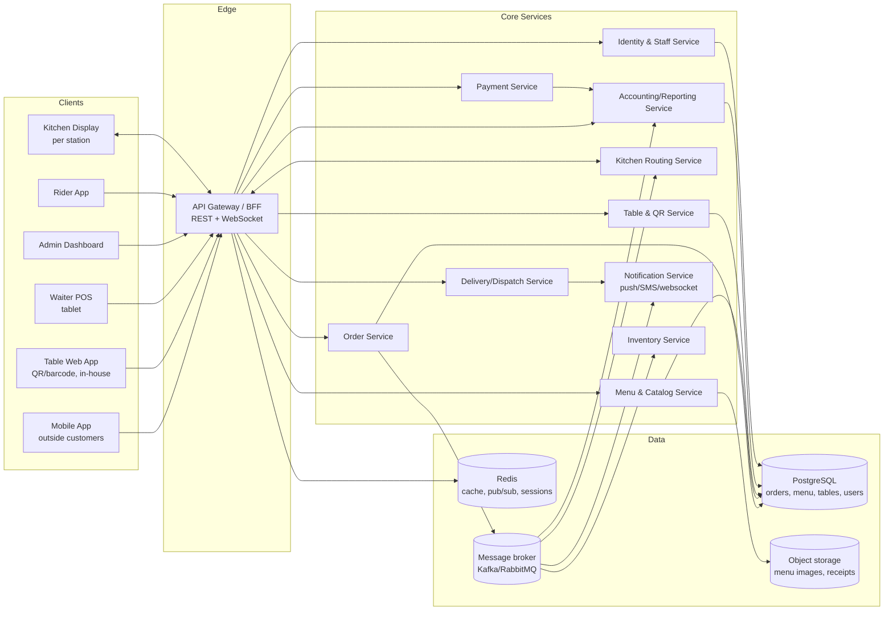
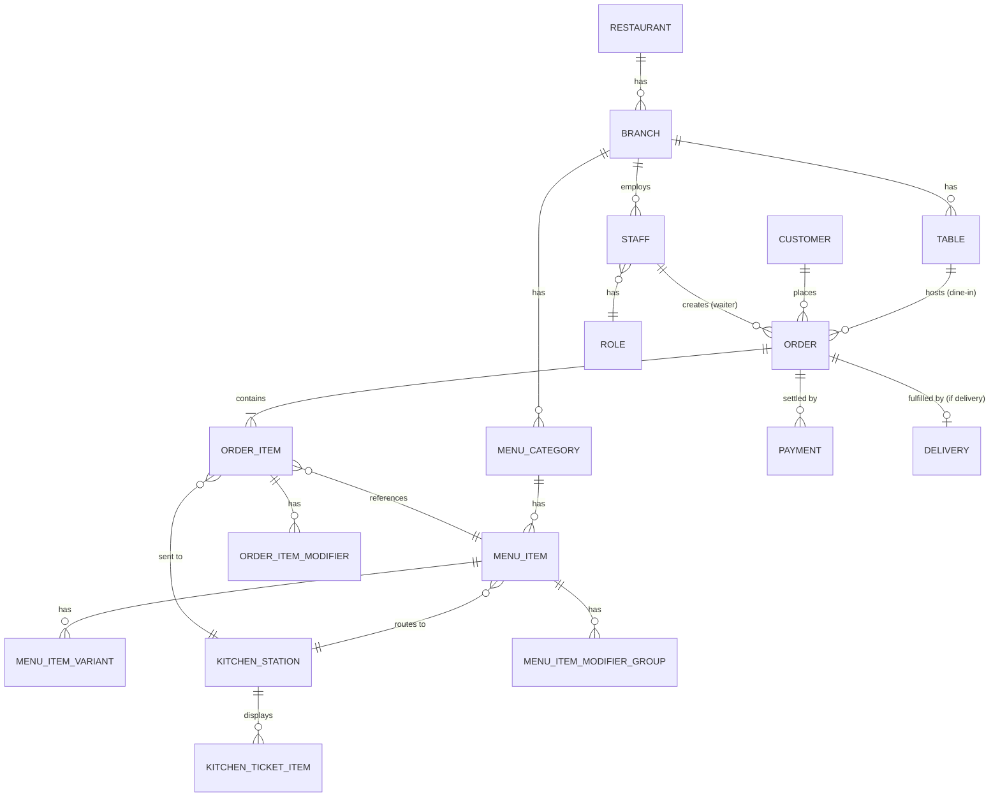
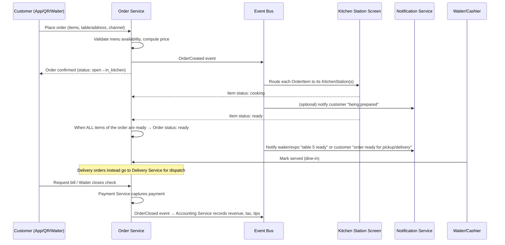

# Restaurant Management System — Implementation Plan

## 1. Vision

A single platform that unifies **three ordering channels** — outside customers on
their phones, in-house customers scanning a table's barcode/QR menu, and
waiters ordering on behalf of guests who don't want to self-serve — into **one
order pipeline** that routes each item to the correct kitchen station in real
time, and feeds a single source of truth for accounting, inventory and
delivery.

Design principle for the whole system: **one Order model, many entry points,
one Kitchen Display System, one ledger.** Every channel (mobile app, table
QR, waiter POS, admin backoffice) is a client of the same core API — nothing
about "how the order was placed" should leak into how it's cooked, billed or
reported.

---

## 2. Actors & Channels

| Actor | Channel | Key need |
|---|---|---|
| Outside customer | Mobile app (iOS/Android) or mobile web | Browse menu, order for delivery/pickup, pay online, track order |
| In-restaurant customer | Scans QR/barcode on table → mobile web (PWA, no install) | See table-specific menu, order & pay from their phone, split bill |
| Waiter | Handheld/tablet POS app | Pick a table, build an order for guests who don't self-order, modify/merge orders, take payment |
| Kitchen staff | Kitchen Display System (KDS) — wall-mounted tablets/TVs per station | See only the items relevant to their station (Pizza, Hookah, Grill, Bar, Cold/Salad, Dessert…), mark items in-progress/ready |
| Cashier / Floor manager | POS / floor-view dashboard | See all open tables, order statuses, close checks, handle refunds |
| Delivery rider | Rider app or third-party integration | Receive dispatch, update delivery status, proof of delivery |
| Owner / Accountant | Admin web dashboard | Menu & pricing management, sales reports, reconciliation, payroll-adjacent tip reports, inventory/COGS |

---

## 3. High-Level Architecture



**Pattern**: modular monolith to start (see §11 on phasing) with clear service
boundaries so it can be split into microservices later if scale demands it.
The **event bus** (order placed, item status changed, payment captured) is
the backbone that lets Kitchen, Accounting, Inventory and Notifications react
independently without the Order Service knowing about all of them.

---

## 4. Technology Stack

### Backend
- **Language/Framework**: Node.js + TypeScript with **NestJS** (structured,
  DI-based, good fit for modular-monolith-to-microservices growth), or
  Go for the real-time-heavy Kitchen/Order path if the team prefers
  stronger typing/performance for concurrency. Recommendation: **NestJS**
  for velocity + one language across backend and both web frontends.
- **API**: REST for CRUD (menu, tables, users, reports) + **WebSocket
  (Socket.IO or native WS via NestJS Gateway)** for real-time order/KDS
  updates. GraphQL optional later for the admin dashboard's flexible
  querying needs — not required for v1.
- **Database**: **PostgreSQL** as system of record (relational integrity
  matters for orders, payments, accounting). **Redis** for caching, session
  storage, rate limiting, and as the pub/sub layer for WebSocket fan-out
  across multiple API instances.
- **Message broker**: **RabbitMQ** (simpler ops, sufficient throughput) or
  Kafka if you want durable event replay for analytics. Recommendation:
  start with **RabbitMQ**.
- **Search** (menu search, reporting): Postgres full-text search is enough
  for v1; add OpenSearch/Elasticsearch only if catalog grows large.
- **File/image storage**: S3-compatible object storage (AWS S3, or
  Cloudflare R2/MinIO if self-hosting) for menu photos, printed-receipt
  PDFs, ID/verification docs for riders.

### Frontend
- **Mobile app** (outside ordering): **React Native (Expo)** — one codebase
  for iOS + Android, fastest path to app-store presence, push notifications
  built in.
- **Table ordering (in-restaurant QR menu)**: **Progressive Web App (PWA)**,
  not a native app — customers must not install anything to scan-and-order.
  Built with **Next.js** or plain React + Vite, optimized for instant load
  on mobile data/restaurant Wi-Fi.
- **Waiter POS**: Tablet-optimized web app (same React codebase family as
  the table PWA, different route/role) or a dedicated React Native tablet
  app if offline-first behavior is required (recommended — see §7.3).
- **Kitchen Display System**: Web app (Next.js/React) running full-screen
  on wall-mounted Android TV boxes or tablets, connected via WebSocket,
  designed for large-touch-target, high-contrast, always-on kiosk mode.
- **Admin dashboard**: React (e.g., **Next.js** + a component library like
  shadcn/ui) with charts (Recharts/Tremor) for sales & accounting views.

### Infra / Cross-cutting
- **Auth**: JWT access + refresh tokens. Customers can order as guest
  (table/session-scoped token, no account needed) or with an account for
  order history/loyalty. Staff (waiter/kitchen/admin) use role-based auth
  (RBAC) tied to a PIN-code fast-login for shared tablets.
- **Payments**: Stripe (or a local/regional PSP, e.g. supports the
  restaurant's country — important since card networks vary by market) for
  online card payments; cash/POS-terminal card handled by the waiter POS
  marking "paid externally" while still reconciled in Accounting.
- **QR/Barcode**: Each table gets a persistent unique code
  (`https://order.restaurant.com/t/{tableId}?tk={signedToken}`) encoded as a
  QR (preferred over 1D barcode for URL capacity) printed as a table tent
  or sticker. Signed token prevents someone from guessing another table's
  ID and adding items to a stranger's bill.
- **Notifications**: Firebase Cloud Messaging / APNs for mobile push (order
  status), WebSocket for KDS/waiter live updates, SMS (Twilio) as delivery
  fallback for outside orders.
- **Infra/Deploy**: Docker containers, orchestrated with Docker Compose for
  a single-location deployment or Kubernetes if multi-location/chain scale
  is a goal. CI/CD via GitHub Actions. Observability: OpenTelemetry +
  Grafana/Loki/Prometheus, or a hosted APM (Datadog/Sentry) for error
  tracking.
- **Multi-tenancy**: even for a single restaurant today, model `restaurant_id`
  / `branch_id` from day one — it costs almost nothing now and saves a
  painful migration if a second location opens.

---

## 5. Core Domain Model



### Key entities
- **Restaurant / Branch** — supports future multi-location.
- **Table** — `number`, `zone` (indoor/patio/VIP), `qr_token`, `capacity`,
  `status` (free/occupied/needs-cleaning/reserved).
- **MenuCategory / MenuItem / MenuItemVariant** (e.g., size)
  **/ ModifierGroup** (e.g., toppings, spice level, "no onions") — a variant
  and its modifiers are what actually get priced and sent to the kitchen.
- **KitchenStation** — `Pizza`, `Hookah`, `Grill`, `Bar/Drinks`, `Cold/Salads`,
  `Dessert`, `Expo` (pass/final assembly). Each `MenuItem` (or even each
  modifier) declares which station(s) it prints to — a pizza with a drink
  add-on generates two ticket lines on two different station screens, both
  linked back to the same order/table so Expo can see when everything's
  ready to go out together.
- **Order** — `channel` (mobile_delivery, mobile_pickup, dine_in_qr,
  dine_in_waiter), `table_id` (nullable for delivery/pickup), `status`
  (open → in_kitchen → ready → served/out_for_delivery → paid/closed →
  cancelled), `source_staff_id` (waiter, if applicable).
- **OrderItem** — snapshot of price/name at order time (never recompute
  historical orders when menu prices change later), `status` per item
  (queued/cooking/ready/served) — **item-level status is what powers the
  KDS**, not just order-level.
- **Payment** — supports split payments, multiple methods per order (part
  cash, part card), tips.
- **Delivery** — address, rider assignment, ETA, proof of delivery, status
  timeline.
- **Staff / Role** — Waiter, Kitchen, Cashier, Manager, Admin, Rider —
  RBAC-gated actions.

---

## 6. Order Flow (the core state machine)



**Item-level, not just order-level, tracking is the crux of the multi-station
kitchen requirement.** The Kitchen Routing Service listens to `OrderCreated`
and `OrderItemAdded` events, groups items by `kitchen_station_id`, and pushes
a "ticket" to each relevant station's WebSocket room. A ticket only shows
that station's items (e.g. Hookah screen never sees pizza items) but carries
the table number/order id so multiple stations can be visually correlated by
staff, and **Expo/Pass** view aggregates all stations for a given order so
staff know when a table's full order is complete and can go out together.

### Order statuses
`draft → placed → accepted → in_kitchen (per item: queued → cooking → ready)
→ ready_to_serve/ready_for_pickup/out_for_delivery → completed → paid →
closed` with `cancelled` and `refunded` as terminal/side states, plus
`needs_attention` for kitchen-flagged issues (item 86'd/out of stock).

---

## 7. Ordering Channels in Detail

### 7.1 Mobile app — outside customers
- Browse branch menu (or pick nearest branch), see photos, prices,
  descriptions, allergens/dietary tags.
- Choose **Delivery** (enter/save address, live rider tracking once
  dispatched) or **Pickup** (choose pickup time slot).
- Cart with modifiers (extra cheese, spice level, no-onions), promo codes,
  loyalty points redemption.
- Checkout: pay online (card/wallet) — required for delivery to reduce
  no-shows; optional "pay at pickup" for pickup orders if the business wants.
- Order tracking screen with live status (accepted → preparing → out for
  delivery/ready for pickup) via push notifications + in-app WebSocket.
- Order history, reorder, saved addresses/cards, ratings/reviews post-order.

### 7.2 In-restaurant QR/barcode table ordering
- Each physical table has a printed QR code (table tent/sticker) encoding a
  signed URL `.../t/{tableId}?tk=...`. Scanning opens a **PWA in the phone
  browser** — no install needed.
- Landing page auto-detects table number from the QR, shows the branch's
  **dine-in menu** (can differ from delivery menu — e.g., dine-in-only items,
  different pricing for on-premise vs. delivery).
- Guests can order individually from their own phones onto the **same table
  session** — the app groups a shared "table cart" so multiple phones at one
  table can add items to a single running order (common for group dining),
  each item tagged with which guest ordered it (for split billing later).
- Orders submitted here have `channel = dine_in_qr` and are auto-routed to
  kitchen stations exactly like other channels.
- Guests can request the bill from the app, choose to pay directly (split by
  item, split evenly, or pay it all) or ask a waiter to bring the check.
- **Item-status feedback loop**: the table PWA shows live status per item
  ("Pizza — cooking 🍕", "Mojito — ready 🍹") using the same WebSocket
  channel the KDS uses, just filtered to that table's order.

### 7.3 Waiter-assisted ordering
- For tables that don't want to self-order, a waiter opens the **Waiter
  POS** (tablet), selects the table from a floor-plan/table-grid view
  (color-coded: free/occupied/order-in-progress/ready/needs-bill), and
  builds the order on the guest's behalf using the identical menu/modifier
  UI as the customer-facing app.
- Waiter orders and QR-self-orders can **coexist on the same table/order** —
  e.g., a table starts self-ordering via QR, then a waiter adds a
  forgotten item, or vice versa; both write to the same underlying `Order`.
- Waiter app needs **offline-first behavior** (queue actions locally, sync
  when connectivity returns) since restaurant Wi-Fi/cellular can be
  unreliable during service — this is why React Native (with a local
  SQLite/WatermelonDB cache) is recommended over a plain web app for this
  specific client.
- Waiter app also handles: splitting/merging bills, applying discounts
  (permission-gated), transferring a table's order to another table,
  voiding items (with reason code, logged for accounting), and taking
  payment (integrates with a card reader via Stripe Terminal or similar,
  plus manual cash entry).

---

## 8. Kitchen Display System (KDS) — station routing

- Each **KitchenStation** (Pizza, Hookah, Grill, Bar, Cold/Salads, Dessert,
  Expo) runs its own screen, subscribed to a WebSocket room
  `station:{branchId}:{stationId}`.
- **Routing rule**: on order creation, the system looks up each
  `OrderItem.menu_item_id → MenuItem.kitchen_station_id` (a menu item can
  map to more than one station only in rare composite cases — generally
  1 item → 1 primary station; if truly composite, e.g. a combo, split it
  into sub-tickets at the modifier/component level) and publishes a ticket
  line to that station only.
- Ticket cards show: table number (or "Delivery #1234"/"Pickup #1234"),
  item + modifiers, order time, elapsed timer (color escalates
  yellow→red the longer it sits — SLA visibility), and a "Bump" button to
  advance status (queued → cooking → ready).
- **Expo/Pass station** aggregates every station's items for a given order
  so the person plating/bagging knows when *all* components (pizza +
  hookah + drink) are ready to be sent out together, avoiding cold food
  waiting on a slow station.
- Configurable **prep-time estimates per item** feed the customer-facing
  "ready in ~15 min" estimate and drive kitchen load-balancing (e.g., don't
  promise a 10-minute ETA if the pizza queue already has 8 pizzas ahead).
- Out-of-stock ("86") toggle: kitchen can mark an item unavailable
  instantly, which hides/disables it across mobile app, table PWA and
  waiter POS in real time via the same event bus.

---

## 9. Menu Design

- **Menu hierarchy**: Category → Item → Variant (size/type) → Modifier
  Groups (required or optional, single- or multi-select, e.g. "Choose spice
  level" required-single, "Extra toppings" optional-multi with upcharges).
- **Channel-specific visibility**: an item/category can be flagged
  available for `dine_in`, `pickup`, `delivery` independently (e.g. Hookah
  is dine-in only; a sauce item is delivery-only packaging SKU).
- **Branch-specific pricing/availability** if multi-location, inherited from
  a master catalog with per-branch overrides.
- **Media**: item photos stored in object storage, served via CDN.
- **Localization**: name/description in multiple languages if needed
  (i18n table) — worth planning for from day one if the market is
  multilingual.
- **Combos/Bundles**: a `MenuItem` of type `combo` referencing multiple
  component items, each still individually routed to its own kitchen
  station.
- Menu changes (price, availability, 86'ing) go live instantly across all
  channels via cache invalidation (Redis) + WebSocket push to already-open
  client sessions.

---

## 10. Accounting, Delivery & Reporting

### Accounting
- Every `OrderClosed`/`PaymentCaptured` event is recorded as an immutable
  ledger entry (append-only `transactions` table) — never mutate historical
  financial records; corrections are new offsetting entries.
- Tracks: gross sales, tax (configurable per region/item category — e.g.
  some regions tax dine-in and takeout differently), discounts, tips
  (with attribution to the waiter who served the table, for payout/tip-pool
  reporting), payment method breakdown (cash vs. card vs. wallet), and
  COGS via the Inventory Service (ingredient costs deducted per recipe on
  order completion) for margin reporting.
- Daily/weekly/monthly reports: sales by channel, by category, by item
  (best-sellers), by station (kitchen load), by staff (waiter performance),
  end-of-day cash reconciliation (expected vs. counted cash drawer).
- Exportable to CSV/PDF and optionally integrable with external accounting
  software (QuickBooks/Xero) via API/CSV for the actual bookkeeping.

### Delivery
- Own `Delivery` record per order: address, geocoding, assigned rider,
  status timeline (assigned → picked_up → en_route → delivered/failed),
  proof of delivery (photo/signature), delivery fee calculation
  (flat/zone/distance-based).
- Either an in-house **Rider app** (same React Native shell, rider role)
  with live GPS tracking shared to the customer's order-tracking screen, or
  integration with third-party delivery providers (e.g., a regional
  delivery API) via an adapter interface in the Delivery Service so both
  can be supported without changing the Order Service.
- Dispatch logic: simplest v1 is manual assignment by a dispatcher/manager;
  v2 can add automatic nearest-rider assignment.

---

## 11. Suggested Repository Structure (monorepo)

```
restaurant-platform/
├── apps/
│   ├── mobile-customer/        # React Native (Expo) - outside ordering
│   ├── table-pwa/              # Next.js/React - QR/barcode dine-in ordering
│   ├── waiter-pos/             # React Native tablet app (offline-first)
│   ├── kitchen-display/        # Next.js/React - KDS, kiosk mode
│   ├── admin-dashboard/        # Next.js - menu, staff, reports, accounting
│   └── rider-app/              # React Native - delivery riders
├── services/
│   ├── api-gateway/            # NestJS - BFF, auth, routing
│   ├── order-service/
│   ├── menu-service/
│   ├── table-service/
│   ├── kitchen-service/
│   ├── payment-service/
│   ├── delivery-service/
│   ├── accounting-service/
│   ├── inventory-service/
│   ├── identity-service/
│   └── notification-service/
├── packages/
│   ├── shared-types/            # TS types/DTOs shared FE+BE
│   ├── ui-components/           # shared design system components
│   └── event-contracts/         # event schema definitions for the bus
├── infra/
│   ├── docker-compose.yml
│   ├── k8s/                     # if/when scaling beyond one host
│   └── ci/
└── docs/
    ├── IMPLEMENTATION_PLAN.md   # this file
    └── api/                     # OpenAPI/AsyncAPI specs
```

Recommendation: use **Turborepo or Nx** to manage this monorepo (shared TS
types between backend DTOs and frontend clients avoid drift, and shared
build/test pipelines).

---

## 12. Non-Functional Requirements

- **Real-time reliability**: KDS and waiter apps are mission-critical during
  service — target < 1s latency from order placement to ticket appearing on
  the station screen; WebSocket reconnect/backoff logic mandatory; consider
  a local fallback (printed kitchen tickets via thermal printer) as a
  degradation path if the network/service fully fails.
- **Offline resilience**: waiter POS must queue actions locally and sync
  (see §7.3); table PWA should gracefully show "reconnecting" rather than
  losing a cart.
- **Security**: table QR tokens signed/expiring to prevent tampering;
  RBAC for all staff actions with audit logging (who voided an item, who
  applied a discount); PCI-DSS scope minimized by using a compliant payment
  processor's hosted fields/SDK rather than handling raw card data.
- **Multi-branch ready**: every table above scoped by `branch_id` even for
  a single-location v1.
- **Accessibility**: KDS high-contrast/large text; customer apps meet basic
  WCAG for menu browsing.
- **Auditability**: financial and order-status transitions are append-only
  event logs, not just mutable row updates — needed for accounting trust
  and dispute resolution.

---

## 13. Phased Roadmap

**Phase 0 — Foundations (weeks 1–2)**
Repo scaffolding, auth/identity service, Postgres schema for
Restaurant/Branch/Table/Staff/MenuItem, CI/CD pipeline.

**Phase 1 — Core ordering + KDS (weeks 3–6)**
Menu service + admin CRUD for menu, Table service + QR generation, Table
PWA ordering flow, Order service with item-level status, Kitchen Routing
Service, KDS app with per-station views, WebSocket real-time pipeline.
→ *Milestone: a customer scans a QR, orders a pizza and a hookah, and they
correctly appear on two different kitchen screens.*

**Phase 2 — Waiter POS + payments (weeks 7–9)**
Waiter app with table grid, offline queueing, order-on-behalf-of flow,
merge with QR orders, Payment service integration (card + cash), bill
splitting.

**Phase 3 — Outside ordering (mobile app) + delivery (weeks 10–13)**
Customer mobile app (delivery/pickup), Delivery service + rider app or
3rd-party integration, order tracking, push notifications.

**Phase 4 — Accounting, inventory, reporting (weeks 14–16)**
Ledger/transactions, COGS via inventory deduction, admin reporting
dashboards, end-of-day reconciliation, exports.

**Phase 5 — Hardening & scale (ongoing)**
Load testing the real-time path, multi-branch rollout, loyalty/promotions,
analytics, printed-ticket fallback, third-party delivery marketplace
integrations if desired.

---

## 14. Open Decisions for the Business to Confirm

1. Which payment processor is available/preferred in your country/region?
2. Do you want your own delivery riders, a third-party delivery
   marketplace, or both?
3. Single location today, or should we actively plan/test multi-branch in
   Phase 1 rather than retrofit later?
4. Do dine-in guests pay via the app themselves, or does payment always go
   through a waiter/cashier?
5. Do you need offline **order-taking** capability for the whole
   restaurant during internet outages (not just the waiter app), i.e. a
   local-network fallback mode?

---

*This document is the living specification for the build. Update it as
decisions in §14 are made and as each phase is delivered.*
